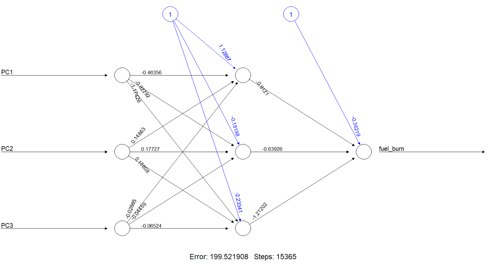

<style>
h1, h2, h3 {
  color: #1a4b84;
}
</style>

# Introdução

A **Aerometrics** desenvolveu um sistema preditivo para estimar o **consumo de combustível** a partir de dados históricos de operações aéreas.

Nesta apresentação serão mostrados:

- Preparação e engenharia de atributos  
- Análise exploratória  
- Modelos preditivos implementados  
- Combinação de modelos (*ensemble*)  
- Previsões finais no conjunto de teste  

# Setup e Estrutura dos Dados

```{r setup, message=FALSE, warning=FALSE}
library(tidyverse)
library(lubridate)
library(e1071)
library(neuralnet)
library(caret)
library(tree)

set.seed(123)

load("data_project_train.Rda")
load("data_project_test.Rda")
```

```{r, echo=FALSE}
head(data_train)
```

# Feature Engineering

Nesta etapa realizamos a criação de novas variáveis derivadas das informações brutas do dataset.\
A engenharia de atributos é fundamental para melhorar a representação dos dados e aumentar o poder preditivo dos modelos.

As principais transformações incluem:

-   **Velocidade média (avg_speed)**: estimada pela razão entre distância voada e tempo de voo.
-   **Indicadores de eficiência**: métricas de consumo por milha náutica e por minuto.
-   **Classificação do tipo de rota**: segmentação dos voos em *curto*, *médio* ou *longo alcance*.
-   **Variáveis temporais**: extração da hora de partida e do período do dia (*manhã*, *tarde*, *noite*).
-   **Índice total de ineficiência operacional**: combinação dos KPIs de decolagem e pouso.

Esses atributos aprimoram a capacidade dos modelos em capturar padrões relevantes associados ao consumo de combustível.

# Feature Engineering - Dataset de Treinamento

```{r}
df_train <- data_train %>%
  mutate(
    avg_speed = flown_distance_enr / (flight_duration / 60),        # NM/h
    fuel_per_nm = fuel_burn / flown_distance_enr,
    fuel_per_min = fuel_burn / flight_duration,
    total_ineff = kpi_inefficiency_dep + kpi_inefficiency_arr,
    flight_range = case_when(
      flown_distance_enr < 400 ~ "Curto",
      flown_distance_enr < 800 ~ "Médio",
      TRUE ~ "Longo"
    ),
    flight_range = factor(flight_range, levels = c('Curto', 'Médio', 'Longo')),
    dep_hour = hour(dep_time),
    dep_period = case_when(
      dep_hour >= 5 & dep_hour < 12 ~ "Manhã",
      dep_hour >= 12 & dep_hour < 18 ~ "Tarde",
      TRUE ~ "Noite"
    ),
    dep_period = factor(dep_period, levels = c("Manhã", "Tarde", "Noite"))
  )
```

# Feature Engineering - Dataset de Teste

```{r}
# Aplicar o mesmo processo à base de teste (sem fuel_burn)
df_test <- data_test %>%
  mutate(
    avg_speed = flown_distance_enr / (flight_duration / 60),
    total_ineff = kpi_inefficiency_dep + kpi_inefficiency_arr,
    flight_range = case_when(
      flown_distance_enr < 400 ~ "Curto",
      flown_distance_enr < 800 ~ "Médio",
      TRUE ~ "Longo"
    ),
    flight_range = factor(flight_range, levels = c('Curto', 'Médio', 'Longo')),
    dep_hour = hour(dep_time),
    dep_period = case_when(
      dep_hour >= 5 & dep_hour < 12 ~ "Manhã",
      dep_hour >= 12 & dep_hour < 18 ~ "Tarde",
      TRUE ~ "Noite"
    ),
    dep_period = factor(dep_period, levels = c("Manhã", "Tarde", "Noite"))
  )
```

# Análise Exploratória

A análise exploratória tem como finalidade compreender o comportamento dos dados de voo e identificar padrões que influenciam o consumo de combustível.

*Principais objetivos:*

- Avaliar distribuições das variáveis operacionais.

- Detectar outliers ou valores inconsistentes que possam afetar a modelagem.

- Investigar relações entre variáveis que influenciam o fuel burn.

- Identificar padrões operacionais úteis para o feature engineering.

- Guiar a escolha dos modelos com base na estrutura e variabilidade dos dados.

# Análise Exploratória

```{r, echo=FALSE}
hist(df_train$flight_duration, col='steelblue', breaks=20, xlab='Flight Duration (min)',main='Flight Duration Distribution')
```

# Análise Exploratória

```{r, echo=FALSE}
hist(df_train$dep_hour, col='steelblue', breaks = 24, xlab='Departure Hour',main='Departure Time Distribution')
```

# Análise Exploratória

```{r, echo=FALSE}
hist(df_train$flown_distance_enr, col='steelblue', breaks = 20, xlab='En Route Distance (nm)',main='Flown Distance En Route Distribution')
```

# Análise Exploratória

```{r, echo=FALSE}
# Distribuição do consumo
hist(df_train$fuel_burn, col='steelblue', breaks=40, xlab='Time flown',main='Fuel Burn Distribution')
```

# Análise Exploratória

```{r, echo=FALSE}
boxplot(fuel_burn ~ aircraft_type, df_train, ylab='Fuel Burn', xlab='Aircraft Type', col='steelblue')
```

# Modelo de Rede Neural

A Aerometrics utilizou uma rede neural simples com função de ativação *tanh* para prever consumo de combustível em escala logaritmizada.

- Os componentes principais (PCA) obtidos serviram como entrada para o modelo, reduzindo complexidade.

- O desempenho foi avaliado via RMSE relativo.

# PCA – Redução de Dimensionalidade

```{r, echo=FALSE}
# PCA
x <- subset(data_train, select=c(8:12))

pca_out <- prcomp(x, scale=TRUE)

var_explained_pc <- pca_out$sdev^2
pve <- var_explained_pc/sum(var_explained_pc)

plot(cumsum(pve), xlab='PC', 
     ylab='Proportion of Variance Explained', type='b')
```

# Rede Neural - Treinamento

```{r}
data_train_pc <- data.frame(pca_out$x)
data_train_pc$fuel_burn <- data_train$fuel_burn %>% log1p() %>% scale()
nn_model <- neuralnet(fuel_burn ~ PC1 + PC2 + PC3, data=data_train_pc, hidden=c(3), 
                      act.fct='tanh', linear.output=TRUE)
```



```{r, echo=FALSE}
pred <- compute(nn_model, data_train_pc[,1:3])$net.result
y_true <- data_train$fuel_burn
y_pred_nn <- expm1(pred * sd(log1p(y_true)) + mean(log1p(y_true)))

RMSE <- mean(abs(y_pred_nn - y_true)/y_true)
cat("RMSE (Rede Neural) =", RMSE)
```

# Modelo de Árvore de Decisão

Também treinamos um modelo baseado em árvore de decisão, que permite interpretar a influência das variáveis de forma mais direta e intuitiva.

- Esse método é útil para capturar relações não lineares e interações.

- A validação cruzada foi utilizada para auxiliar na poda da árvore.

## Código

```{r}
tree_model <- tree(
fuel_burn ~ airline + aircraft_type + flown_distance_enr +
flight_duration + total_ineff + flight_range + dep_hour,
df_train, mindev=0.001
)
```

```{r, echo=FALSE}
y_pred_dt <- predict(tree_model, df_train)

RMSE <- mean(abs(y_pred_dt - y_true)/y_true)
print(paste("RMSE (Árvore):", RMSE))
```

# Árvore de Decisão

```{r, echo=FALSE}
plot(tree_model)
text(tree_model)
```

# Árvore de Decisão

```{r, echo=FALSE}
plot(tree_model)
```

# Validação Cruzada - Árvore

```{r, echo=FALSE}
cv_results <- cv.tree(tree_model, FUN=prune.tree, K=10)
plot(cv_results$size, cv_results$dev, ylab='Deviance', xlab='Size', type='b')
```

# Ensemble - Combinação NN + Árvore

```{r}
df_ensemble <- data.frame(fuel_burn = data_train$fuel_burn, nn = y_pred_nn, dt = y_pred_dt)
model_ensemble <- lm(fuel_burn ~ nn + dt, df_ensemble)
summary(model_ensemble)
```

# Ensemble: Combinação dos Modelos

Com o objetivo de melhorar a capacidade preditiva final, foi criado um modelo ensemble linear combinando:

- As previsões da rede neural.

- As previsões da árvore de decisão.

Os pesos foram estimados por regressão linear (LM), permitindo que o ensemble aprenda automaticamente qual modelo tem maior poder explicativo.

## Resultado

```{r}
data_train$prediction_ensemble <- predict(model_ensemble, df_ensemble)

mean(abs(data_train$fuel_burn - data_train$prediction_ensemble) / data_train$fuel_burn)
```

# Previsões do Conjunto de Teste

Após treinar e calibrar, aplicamos o pipeline completo ao conjunto de teste:

- Aplicação do mesmo feature engineering.

- Projeção dos dados no espaço do PCA (usando o pca_out do treino).

- Predição individual pelos modelos (NN e DT).

- Combinação final pelo ensemble (usando os coef do treino).

```{r}
mean_train <- mean(log1p(data_train$fuel_burn))
sd_train   <- sd(log1p(data_train$fuel_burn))

x_test <- subset(data_test, select=c(8:12))
data_test_pc <- predict(pca_out, newdata=x_test) |> as.data.frame()
data_test_pc$fuel_burn <- (log1p(data_test$fuel_burn) - mean_train) / sd_train

y_test_scaled <- predict(nn_model, data_test_pc)
y_pred_nn <- expm1(y_test_scaled * sd_train + mean_train)
y_pred_dt <- predict(tree_model, df_test)

w <- coef(model_ensemble)
data_test$fuel_burn <- w["nn"] * y_pred_nn + w["dt"] * y_pred_dt
```

# Conclusões

- O pipeline Aerometrics integra engenharia de atributos, PCA, rede neural e árvore de decisão.

- O modelo ensemble mostrou melhor robustez geral.

- A solução final está pronta para uso operacional.
